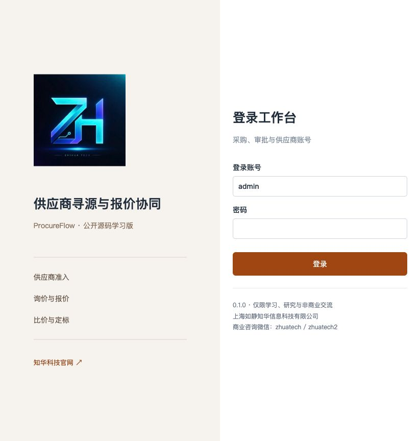
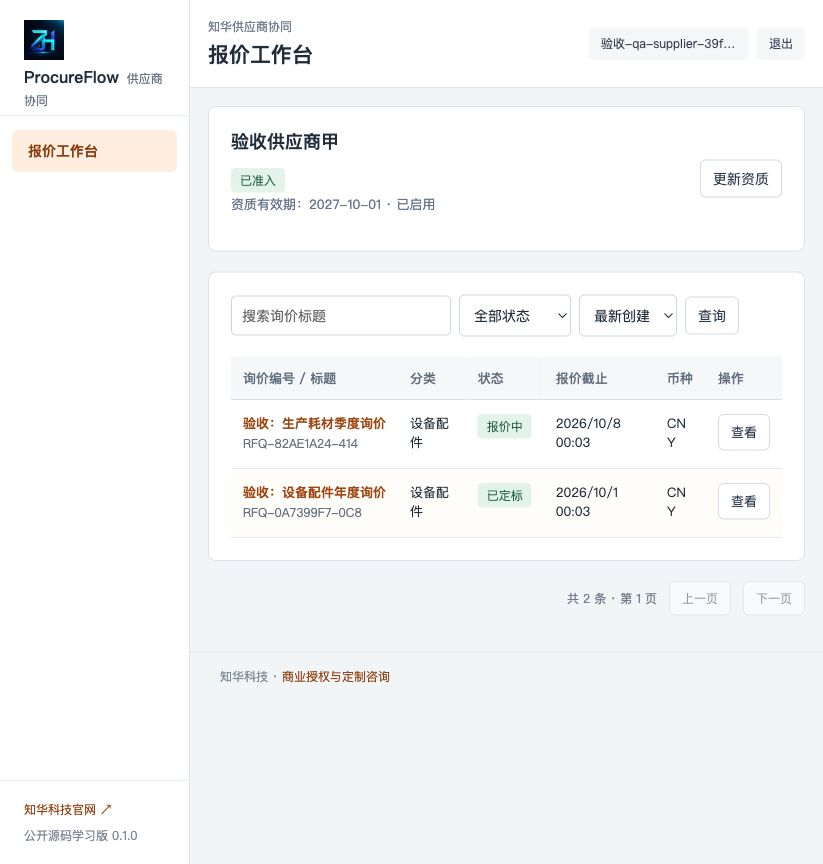
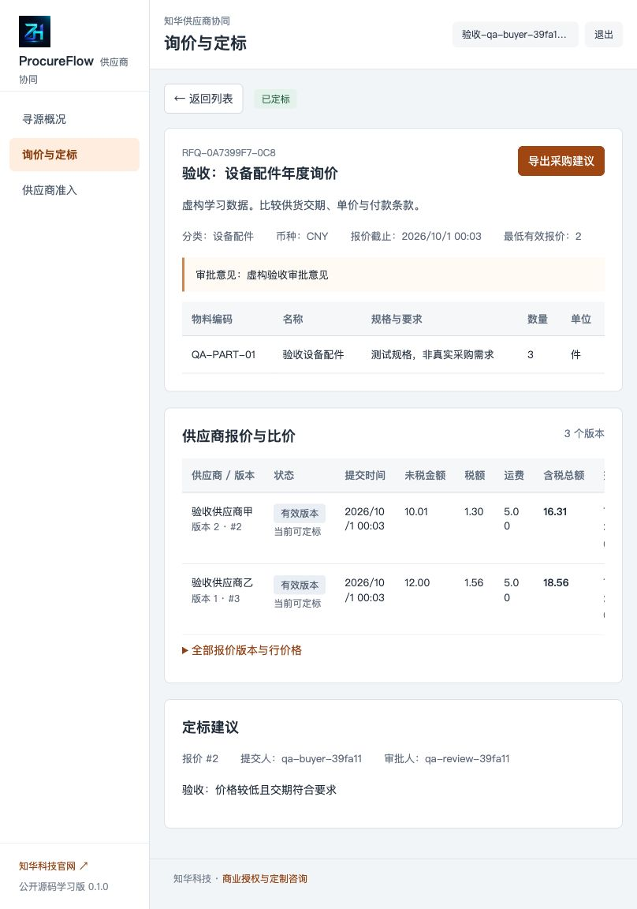
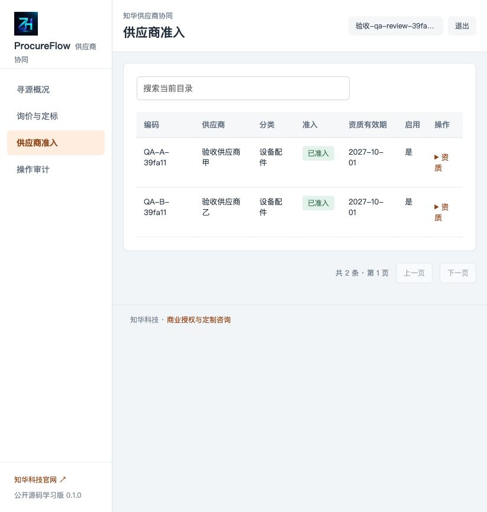
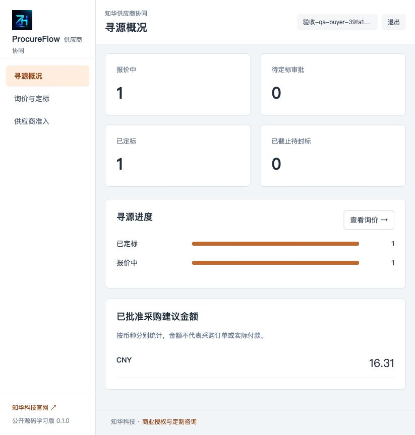
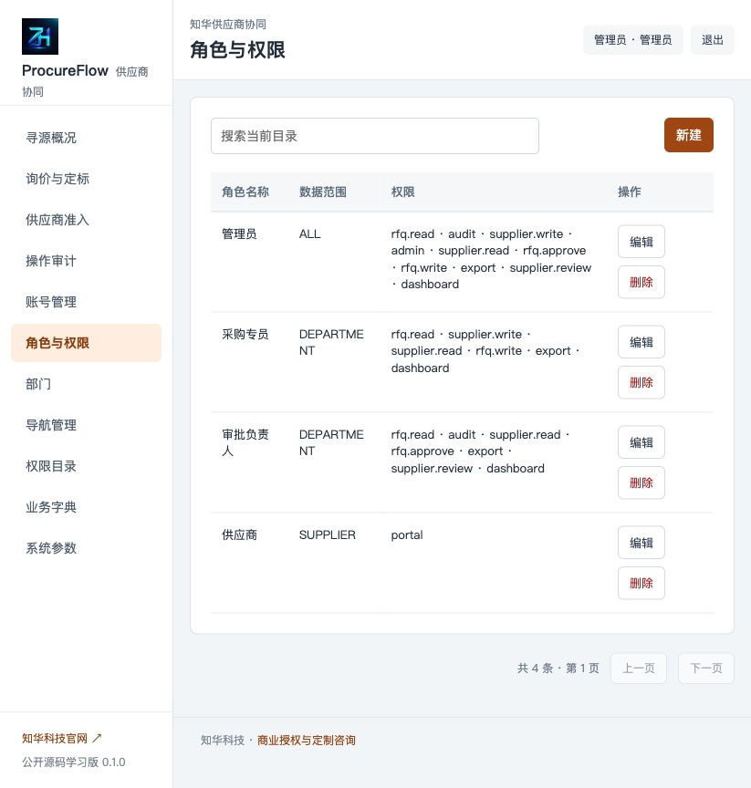

<p></p>

# 知华供应商寻源与报价协同 ProcureFlow

**公开源码学习版 0.1.0**

知华科技（上海如静知华信息科技有限公司）提供。[知华科技官网](https://www.zhuatech.cn/)。

面向设备服务商和中小制造企业的采购准备环节：把供应商资质、询价需求、报价版本、比价理由和审批结果保存在同一条可追溯流程中。采购方与受邀供应商使用独立工作台，避免聊天记录覆盖报价、报价口径不一致及审批依据丢失。

## 从供应商准入到采购建议

```text
供应商建档 → 资质审核 → 已准入供应商
                           ↓
编制询价与需求行 → 独立发布审批 → 邀请供应商报价
                                      ↓
                            密封报价 / 重报 / 撤回
                                      ↓
                         截止 → 封标 → 查看并比较报价
                                      ↓
                         选择理由 → 独立定标审批
                                      ↓
                         冻结采购建议 → JSON导出
```

发布后需求与邀请名单不能修改。供应商仅能查看自己的报价；采购方在封标前只见提交状态与版本。重报生成不可变新版本，旧版本仍可追溯。采购建议属于上游寻源结果，不生成采购订单、库存、应付或付款记录。

### 实际功能

| 模块 | 能力与约束 |
| --- | --- |
| 供应商准入 | 分类、联系方式、资质说明、有效期、启停；保存后重新审核；资质提交人不能自行审批 |
| 询价管理 | 多需求行、规格、单位、数量、币种、邀请名单；搜索、状态过滤、数据库分页与排序；草稿编辑和删除 |
| 发布审批 | 提交、批准、退回；提交人和审批人分离；最低受邀数量来自系统参数并固化 |
| 供应商门户 | 绑定供应商账号、受邀询价、完整逐行报价、有效期、交期、税率、运费与付款条款；重报与撤回 |
| 密封与比价 | 截止前后端屏蔽采购方价格；截止后人工封标；当前有效报价按含税金额排列，保留所有版本与行价格 |
| 定标 | 人工选择与理由、有效报价不足的例外说明、独立审批、退回重新比价；未准入、停用或过期供应商及报价不可定标 |
| 采购建议 | 已定标结果冻结为版本化JSON，固定物料、数量、单价、税额、运费、供应商编码与审批信息；下载另记审计 |
| 账号与权限 | BCrypt、会话、CSRF、修改密码、账号禁用、角色与实时接口权限、部门范围、供应商绑定与门户隔离 |
| 管理配置 | 部门、权限目录、内建菜单名称/顺序/启停/权限、业务字典、ISO币种、时区、工作台显示名称、最低有效报价数量 |
| 统计与审计 | 当前数据范围的状态数量、已截止待封标数量、按币种分别统计已批准建议金额、操作与审批审计 |

### 版本边界

- 单企业实例按部门管理采购资料；供应商账号按绑定供应商隔离。不是多租户SaaS。
- 无自动订单接口。导出的 `PROCUREMENT_ADVICE` 是采购建议，接收方需核对供应商及物料编码、复核并生成采购订单；进销存导入连接器尚未实现。
- 资质是文本登记和人工核验说明，不联网验真，不提供资质文件上传、电子签章、招投标法律效力或合规认证。
- 不包含在线支付、收发货、库存、应收应付、合同、汇率换算、自动评分、外部AI、邮件及微信自动通知。
- 报价采用同询价币种。支持ISO中两位小数币种；数量3位、未税单价4位、税率2位；逐行先舍入未税额，再计算税额，最后加含税运费。非税务发票计算工具。
- 截止和有效期使用UTC时间；资质有效期须晚于UTC当天。页面按系统配置时区显示，日期输入使用浏览器本地时区。到点后停止报价，采购专员人工封标，系统不提前自动解密。
- 角色、部门、供应商目录和审计列表每类最多10,000条；询价数据库分页。大规模场景需要扩展主数据分页、报表聚合、限流及性能验收。
- 同部门业务写操作采用数据库部门行锁，保证审批、资质和报价一致性；会降低同部门高并发吞吐。会话和登录失败限制在单后端进程内，重启需要重新登录。

## 实际运行页面

截图来自当前运行版本，业务资料明确标为虚构验收数据。

| 登录 | 供应商用户端首页 |
| --- | --- |
|  |  |

| 核心询价与比价 | 后台供应商管理 |
| --- | --- |
|  |  |

| 寻源统计 | 角色与权限 |
| --- | --- |
|  |  |

供应商用户端只显示受邀已发布询价、本人报价及定标结果；采购端编制询价、比价、提交建议；审批端审核资质、发布和定标；管理员配置账号与访问范围。见[操作手册](docs/操作手册.md)。

## 工程和运行版本

浏览器 → Nginx同源 `/api` → Spring Security → 权限及数据范围 → JPA事务 → MySQL。Flyway迁移建表，Hibernate只验证结构。

| 层 | 版本 |
| --- | --- |
| 后端 | Java21、Spring Boot4.0.7、Security、JPA、Flyway；MariaDB Connector/J3.5.10连接MySQL |
| 前端 | Vue3.5.40、Vite8.1.5、JavaScript；Node24.19.0或以上；精确依赖锁文件 |
| 基础设施 | MySQL8.4、Nginx1.29、Docker Compose v2、Maven3.9 |
| 验收工具 | Python3.11或以上，仅标准库 |

```text
backend/src/main/java/cn/zhuatech/procureflow/  身份、准入、询价、报价和审批
backend/src/main/resources/db/migration/      Flyway版本脚本
backend/src/test/                             金额单元测试与真实HTTP集成测试
frontend/src/                                采购、审批和供应商操作页面
frontend/public/brand/                        正式LOGO
docs/images/                                 两张原始官方咨询二维码
docs/screenshots/                            当前版本真实运行截图
scripts/                                     配置生成、HTTP验收和发布检查
compose.yaml                                 完整学习环境
```

## 首次启动

```bash
python3 scripts/init-env.py
docker compose config --quiet
docker compose up -d --build --wait --wait-timeout 240
```

前端：[http://127.0.0.1:8097](http://127.0.0.1:8097)。健康：[http://127.0.0.1:8097/actuator/health](http://127.0.0.1:8097/actuator/health)。

空库首次账号 **admin**，密码读取本机 `.env` 的 `ADMIN_PASSWORD`；没有共享默认密码。配置脚本生成三个独立随机密码，文件权限600，拒绝覆盖已有配置；`.env`不提交。空库创建总部、四个角色、权限、导航、业务分类及参数，没有供应商或报价等业务记录。

登录后创建不同的采购与审批账号；供应商角色必须绑定同部门供应商。不共享管理员账号。修改环境变量不会重置已存在管理员密码，通过账号管理或“账号与关于”修改密码。

### 配置项

| 名称 | 用途 |
| --- | --- |
| `DATABASE_PASSWORD` | MySQL业务账号密码，必填 |
| `MYSQL_ROOT_PASSWORD` | MySQL管理密码，必填 |
| `ADMIN_PASSWORD` | 空库首次管理员密码，12–72位含大小写和数字 |
| `WEB_PORT` / `BIND_ADDRESS` | 默认8097 / 127.0.0.1，可覆盖避免多项目冲突 |
| `COOKIE_SECURE` | 本机HTTP为false；HTTPS部署设true |
| `DATABASE_URL` / `DATABASE_USER` | 直接本地启动时的数据库地址和账号；另可用DATABASE_CATALOG指定本地数据库名 |

源码 `.env.example`只列名称和安全说明；本机学习环境不公开数据库和后端端口。端口覆盖：`WEB_PORT=8297 docker compose up -d`，访问和健康检查使用8297。

### 本地开发

准备独立MySQL8.4数据库 `zhuatech_procureflow`，注入 `DATABASE_URL`、`DATABASE_USER`、`DATABASE_PASSWORD`和 `ADMIN_PASSWORD`。

```bash
cd backend
mvn spotless:check test
mvn spring-boot:run
# 另开终端
cd frontend
npm ci
npm run dev
```

Vite开发地址默认127.0.0.1:5173，仅开发代理到8080。部署页面通过Nginx服务名代理，不依赖宿主机后端地址。

## 数据库与升级

数据库脚本与迁移：[V1__sourcing.sql](backend/src/main/resources/db/migration/V1__sourcing.sql)。保存部门、角色与权限、账号、菜单、供应商、询价、需求行、邀请、报价与行、幂等请求、参数、字典和审计。包含业务外键、唯一键、非负金额约束、部门状态索引和乐观版本。

MySQL使用 `mysql-data` 持久卷。应用首次自动迁移，重启不重置账号和业务；升级只新增 `V2__...` 等迁移，不能改已执行文件。先备份数据库，再升级镜像并启动。见[部署与升级](docs/部署与升级.md)。

## 检查与验收

```bash
# 后端目录
mvn spotless:check test package
# 前端目录
npm ci
npm run format:check
npm run lint
npm test
npm run build
# 项目根目录
docker compose config --quiet
docker compose build
python3 scripts/release-check.py
git diff --check
```

完整HTTP验收仅运行于独立本机测试环境，会创建明确标记的测试数据：

```bash
docker compose -p procureflow-qa up -d --build --wait --wait-timeout 240
python3 scripts/smoke.py --allow-test-data
# 验收结束，只销毁上面这个独立测试环境
docker compose -p procureflow-qa down -v
```

后端测试使用H2 MySQL兼容模式执行真实Flyway脚本；另需全新MySQL卷进行完整部署验收。测试范围和结果见[测试与验收](docs/测试与验收.md)。Docker Maven构建包含测试，不跳过失败检查。

## 安全、故障与反馈

会话Cookie为HttpOnly、SameSite=Strict；写接口使用CSRF；实时权限与供应商/部门范围在服务端核验。修改密码后旧会话失效，禁用账号和撤销角色权限即时生效；询价写请求校验版本与幂等键。重试必须保留原请求标识和内容；请求改变须使用新标识。

学习Compose仅本机监听，容器内网数据库连接使用TLS但不校验证书。商业部署需要书面授权、HTTPS、`COOKIE_SECURE=true`、数据库证书校验、网关限流、审计保护、备份恢复和单独安全评估。无MFA、分布式会话、专用病毒扫描或高可用部署。

| 故障 | 处理 |
| --- | --- |
| 缺少配置 / 密码拒绝 | 运行配置脚本，核对字段与密码要求；不要提交.env |
| 端口被占用 | 覆盖WEB_PORT，保留其他项目服务 |
| 容器不健康 | 查看对应服务日志，核对MySQL凭据、迁移和外键结构 |
| 修改环境密码仍不能登录 | 初始化只在空库执行，使用账号管理重置已有账号 |
| 403 | 核对角色、部门/供应商绑定、CSRF以及提交人与审批人分离 |
| 409版本冲突 | 刷新详情，确认他人变更后重新操作 |
| 无法封标 / 报价 | 封标须已截止；报价和撤回须尚未截止 |
| 无法选择报价 | 检查报价有效期、准入有效期、启用状态与版本 |
| 构建下载失败 | 检查网络后重试，保留测试与迁移检查 |

欢迎通过仓库Issue/PR提交可复现问题、小范围改进及测试；贡献者须拥有提交权利并同意本项目许可。不要提交真实客户资料、联系方式、资质文件、凭证或未脱敏日志。安全漏洞通过下方微信私下反馈，不在公开Issue披露敏感信息与攻击细节。

自有代码适用[LICENSE](LICENSE)非商业源码许可，不属于OSI标准开源许可证。第三方依赖保留自身版权与许可，见[第三方说明](docs/第三方说明.md)。软件按现状提供，正式适用性与交付范围应另行书面约定。

## 联系知华科技

本项目由知华科技（上海如静知华信息科技有限公司）提供公开源码学习版本，主要用于个人学习、技术研究与非商业交流。未经书面授权不得商用。企业信息化建设、中小企业数字化转型、中小企业 AI 转型、私有化部署、软件外包、软件项目外包、软件实施、FDE 外包、OPC 技术支持及深度定制开发，请访问知华科技官网 <https://www.zhuatech.cn/>，或添加微信 zhuatech、zhuatech2 咨询。

<table><tr><td align="center"><br>微信：zhuatech</td><td align="center"><br>微信：zhuatech2</td></tr></table>
